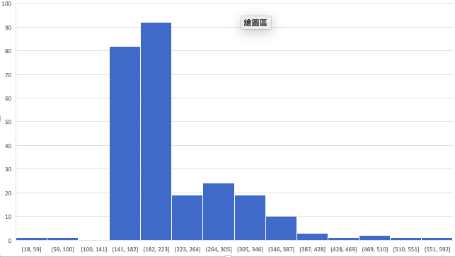
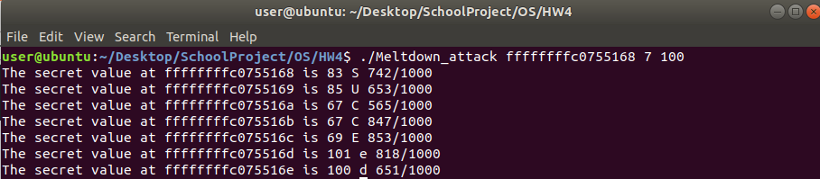
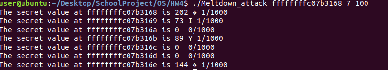

# OS HW4 Report

> 0710006 盧可瑜

## Meltdown

- 只有在特定的 CPU 上才能進行
- 它是利用 CPU 是將 OP 拆成很多 µOPs，然後不按照順序運算。因此有些不該被執行到的運算會在 CPU 做 Exception Handle 前就先執行，而那些資料會在處理 Exception 前從 register 搬到 cache。
- Meltdown 透過 `Flush+Reload` 等方式，竊取了 cache 的資料。


## Task1


```c
// toy.c
int data = 34;
char kernel_data = *(char*)kernel_addr; /*exception occurred*/
probe_array[data * 4096 + DELTA] += 1;
```

觀察結果，可以發現在 `probe_array[34 * 4096]` 的那行，得到的時間是 76，特別的小，可推測那時發生了 `cache hit`。

### Result

```
user@ubuntu:~/Desktop/SchoolProject/OS/HW4$ ./toy.o ffffffffc0755168
time of accessing elements in probe_array[0*4096]: 18
time of accessing elements in probe_array[1*4096]: 376
time of accessing elements in probe_array[2*4096]: 352
time of accessing elements in probe_array[3*4096]: 212
time of accessing elements in probe_array[4*4096]: 294
time of accessing elements in probe_array[5*4096]: 194
time of accessing elements in probe_array[6*4096]: 176
time of accessing elements in probe_array[7*4096]: 160
time of accessing elements in probe_array[8*4096]: 196
time of accessing elements in probe_array[9*4096]: 212
time of accessing elements in probe_array[10*4096]: 310
time of accessing elements in probe_array[11*4096]: 326
time of accessing elements in probe_array[12*4096]: 164
time of accessing elements in probe_array[13*4096]: 160
time of accessing elements in probe_array[14*4096]: 158
time of accessing elements in probe_array[15*4096]: 314
time of accessing elements in probe_array[16*4096]: 328
time of accessing elements in probe_array[17*4096]: 196
time of accessing elements in probe_array[18*4096]: 314
time of accessing elements in probe_array[19*4096]: 182
time of accessing elements in probe_array[20*4096]: 298
time of accessing elements in probe_array[21*4096]: 504
time of accessing elements in probe_array[22*4096]: 160
time of accessing elements in probe_array[23*4096]: 316
time of accessing elements in probe_array[24*4096]: 300
time of accessing elements in probe_array[25*4096]: 160
time of accessing elements in probe_array[26*4096]: 504
time of accessing elements in probe_array[27*4096]: 290
time of accessing elements in probe_array[28*4096]: 290
time of accessing elements in probe_array[29*4096]: 176
time of accessing elements in probe_array[30*4096]: 312
time of accessing elements in probe_array[31*4096]: 196
time of accessing elements in probe_array[32*4096]: 182
time of accessing elements in probe_array[33*4096]: 214
time of accessing elements in probe_array[34*4096]: 76
time of accessing elements in probe_array[35*4096]: 294
time of accessing elements in probe_array[36*4096]: 162
time of accessing elements in probe_array[37*4096]: 178
time of accessing elements in probe_array[38*4096]: 158
time of accessing elements in probe_array[39*4096]: 160
time of accessing elements in probe_array[40*4096]: 216
time of accessing elements in probe_array[41*4096]: 178
time of accessing elements in probe_array[42*4096]: 178
time of accessing elements in probe_array[43*4096]: 160
time of accessing elements in probe_array[44*4096]: 158
time of accessing elements in probe_array[45*4096]: 170
time of accessing elements in probe_array[46*4096]: 180
time of accessing elements in probe_array[47*4096]: 542
time of accessing elements in probe_array[48*4096]: 362
time of accessing elements in probe_array[49*4096]: 180
time of accessing elements in probe_array[50*4096]: 216
time of accessing elements in probe_array[51*4096]: 328
time of accessing elements in probe_array[52*4096]: 198
time of accessing elements in probe_array[53*4096]: 204
time of accessing elements in probe_array[54*4096]: 278
time of accessing elements in probe_array[55*4096]: 160
time of accessing elements in probe_array[56*4096]: 160
time of accessing elements in probe_array[57*4096]: 180
time of accessing elements in probe_array[58*4096]: 230
time of accessing elements in probe_array[59*4096]: 322
time of accessing elements in probe_array[60*4096]: 412
time of accessing elements in probe_array[61*4096]: 216
time of accessing elements in probe_array[62*4096]: 202
time of accessing elements in probe_array[63*4096]: 196
time of accessing elements in probe_array[64*4096]: 258
time of accessing elements in probe_array[65*4096]: 180
time of accessing elements in probe_array[66*4096]: 300
time of accessing elements in probe_array[67*4096]: 202
time of accessing elements in probe_array[68*4096]: 222
time of accessing elements in probe_array[69*4096]: 198
time of accessing elements in probe_array[70*4096]: 212
time of accessing elements in probe_array[71*4096]: 214
time of accessing elements in probe_array[72*4096]: 194
time of accessing elements in probe_array[73*4096]: 372
time of accessing elements in probe_array[74*4096]: 182
time of accessing elements in probe_array[75*4096]: 178
time of accessing elements in probe_array[76*4096]: 280
time of accessing elements in probe_array[77*4096]: 376
time of accessing elements in probe_array[78*4096]: 176
time of accessing elements in probe_array[79*4096]: 180
time of accessing elements in probe_array[80*4096]: 196
time of accessing elements in probe_array[81*4096]: 158
time of accessing elements in probe_array[82*4096]: 342
time of accessing elements in probe_array[83*4096]: 178
time of accessing elements in probe_array[84*4096]: 172
time of accessing elements in probe_array[85*4096]: 296
time of accessing elements in probe_array[86*4096]: 222
time of accessing elements in probe_array[87*4096]: 328
time of accessing elements in probe_array[88*4096]: 338
time of accessing elements in probe_array[89*4096]: 232
time of accessing elements in probe_array[90*4096]: 196
time of accessing elements in probe_array[91*4096]: 322
time of accessing elements in probe_array[92*4096]: 296
time of accessing elements in probe_array[93*4096]: 176
time of accessing elements in probe_array[94*4096]: 160
time of accessing elements in probe_array[95*4096]: 296
time of accessing elements in probe_array[96*4096]: 158
time of accessing elements in probe_array[97*4096]: 160
time of accessing elements in probe_array[98*4096]: 276
time of accessing elements in probe_array[99*4096]: 296
time of accessing elements in probe_array[100*4096]: 296
time of accessing elements in probe_array[101*4096]: 258
time of accessing elements in probe_array[102*4096]: 176
time of accessing elements in probe_array[103*4096]: 312
time of accessing elements in probe_array[104*4096]: 178
time of accessing elements in probe_array[105*4096]: 358
time of accessing elements in probe_array[106*4096]: 184
time of accessing elements in probe_array[107*4096]: 298
time of accessing elements in probe_array[108*4096]: 198
time of accessing elements in probe_array[109*4096]: 296
time of accessing elements in probe_array[110*4096]: 184
time of accessing elements in probe_array[111*4096]: 158
time of accessing elements in probe_array[112*4096]: 180
time of accessing elements in probe_array[113*4096]: 158
time of accessing elements in probe_array[114*4096]: 178
time of accessing elements in probe_array[115*4096]: 202
time of accessing elements in probe_array[116*4096]: 162
time of accessing elements in probe_array[117*4096]: 158
time of accessing elements in probe_array[118*4096]: 240
time of accessing elements in probe_array[119*4096]: 204
time of accessing elements in probe_array[120*4096]: 202
time of accessing elements in probe_array[121*4096]: 158
time of accessing elements in probe_array[122*4096]: 250
time of accessing elements in probe_array[123*4096]: 228
time of accessing elements in probe_array[124*4096]: 214
time of accessing elements in probe_array[125*4096]: 212
time of accessing elements in probe_array[126*4096]: 218
time of accessing elements in probe_array[127*4096]: 466
time of accessing elements in probe_array[128*4096]: 214
time of accessing elements in probe_array[129*4096]: 226
time of accessing elements in probe_array[130*4096]: 198
time of accessing elements in probe_array[131*4096]: 296
time of accessing elements in probe_array[132*4096]: 212
time of accessing elements in probe_array[133*4096]: 212
time of accessing elements in probe_array[134*4096]: 238
time of accessing elements in probe_array[135*4096]: 238
time of accessing elements in probe_array[136*4096]: 176
time of accessing elements in probe_array[137*4096]: 214
time of accessing elements in probe_array[138*4096]: 202
time of accessing elements in probe_array[139*4096]: 198
time of accessing elements in probe_array[140*4096]: 212
time of accessing elements in probe_array[141*4096]: 178
time of accessing elements in probe_array[142*4096]: 214
time of accessing elements in probe_array[143*4096]: 200
time of accessing elements in probe_array[144*4096]: 296
time of accessing elements in probe_array[145*4096]: 214
time of accessing elements in probe_array[146*4096]: 202
time of accessing elements in probe_array[147*4096]: 194
time of accessing elements in probe_array[148*4096]: 214
time of accessing elements in probe_array[149*4096]: 164
time of accessing elements in probe_array[150*4096]: 200
time of accessing elements in probe_array[151*4096]: 220
time of accessing elements in probe_array[152*4096]: 180
time of accessing elements in probe_array[153*4096]: 298
time of accessing elements in probe_array[154*4096]: 218
time of accessing elements in probe_array[155*4096]: 364
time of accessing elements in probe_array[156*4096]: 196
time of accessing elements in probe_array[157*4096]: 200
time of accessing elements in probe_array[158*4096]: 164
time of accessing elements in probe_array[159*4096]: 184
time of accessing elements in probe_array[160*4096]: 176
time of accessing elements in probe_array[161*4096]: 188
time of accessing elements in probe_array[162*4096]: 198
time of accessing elements in probe_array[163*4096]: 324
time of accessing elements in probe_array[164*4096]: 180
time of accessing elements in probe_array[165*4096]: 166
time of accessing elements in probe_array[166*4096]: 292
time of accessing elements in probe_array[167*4096]: 202
time of accessing elements in probe_array[168*4096]: 214
time of accessing elements in probe_array[169*4096]: 164
time of accessing elements in probe_array[170*4096]: 180
time of accessing elements in probe_array[171*4096]: 176
time of accessing elements in probe_array[172*4096]: 262
time of accessing elements in probe_array[173*4096]: 212
time of accessing elements in probe_array[174*4096]: 350
time of accessing elements in probe_array[175*4096]: 278
time of accessing elements in probe_array[176*4096]: 298
time of accessing elements in probe_array[177*4096]: 164
time of accessing elements in probe_array[178*4096]: 180
time of accessing elements in probe_array[179*4096]: 184
time of accessing elements in probe_array[180*4096]: 188
time of accessing elements in probe_array[181*4096]: 382
time of accessing elements in probe_array[182*4096]: 164
time of accessing elements in probe_array[183*4096]: 212
time of accessing elements in probe_array[184*4096]: 214
time of accessing elements in probe_array[185*4096]: 202
time of accessing elements in probe_array[186*4096]: 226
time of accessing elements in probe_array[187*4096]: 172
time of accessing elements in probe_array[188*4096]: 218
time of accessing elements in probe_array[189*4096]: 248
time of accessing elements in probe_array[190*4096]: 212
time of accessing elements in probe_array[191*4096]: 210
time of accessing elements in probe_array[192*4096]: 290
time of accessing elements in probe_array[193*4096]: 248
time of accessing elements in probe_array[194*4096]: 216
time of accessing elements in probe_array[195*4096]: 228
time of accessing elements in probe_array[196*4096]: 202
time of accessing elements in probe_array[197*4096]: 164
time of accessing elements in probe_array[198*4096]: 218
time of accessing elements in probe_array[199*4096]: 214
time of accessing elements in probe_array[200*4096]: 186
time of accessing elements in probe_array[201*4096]: 162
time of accessing elements in probe_array[202*4096]: 326
time of accessing elements in probe_array[203*4096]: 212
time of accessing elements in probe_array[204*4096]: 254
time of accessing elements in probe_array[205*4096]: 194
time of accessing elements in probe_array[206*4096]: 242
time of accessing elements in probe_array[207*4096]: 556
time of accessing elements in probe_array[208*4096]: 212
time of accessing elements in probe_array[209*4096]: 160
time of accessing elements in probe_array[210*4096]: 216
time of accessing elements in probe_array[211*4096]: 176
time of accessing elements in probe_array[212*4096]: 162
time of accessing elements in probe_array[213*4096]: 158
time of accessing elements in probe_array[214*4096]: 216
time of accessing elements in probe_array[215*4096]: 160
time of accessing elements in probe_array[216*4096]: 162
time of accessing elements in probe_array[217*4096]: 156
time of accessing elements in probe_array[218*4096]: 364
time of accessing elements in probe_array[219*4096]: 226
time of accessing elements in probe_array[220*4096]: 188
time of accessing elements in probe_array[221*4096]: 184
time of accessing elements in probe_array[222*4096]: 198
time of accessing elements in probe_array[223*4096]: 188
time of accessing elements in probe_array[224*4096]: 158
time of accessing elements in probe_array[225*4096]: 414
time of accessing elements in probe_array[226*4096]: 172
time of accessing elements in probe_array[227*4096]: 176
time of accessing elements in probe_array[228*4096]: 158
time of accessing elements in probe_array[229*4096]: 158
time of accessing elements in probe_array[230*4096]: 198
time of accessing elements in probe_array[231*4096]: 198
time of accessing elements in probe_array[232*4096]: 204
time of accessing elements in probe_array[233*4096]: 174
time of accessing elements in probe_array[234*4096]: 342
time of accessing elements in probe_array[235*4096]: 158
time of accessing elements in probe_array[236*4096]: 194
time of accessing elements in probe_array[237*4096]: 162
time of accessing elements in probe_array[238*4096]: 176
time of accessing elements in probe_array[239*4096]: 158
time of accessing elements in probe_array[240*4096]: 206
time of accessing elements in probe_array[241*4096]: 188
time of accessing elements in probe_array[242*4096]: 170
time of accessing elements in probe_array[243*4096]: 226
time of accessing elements in probe_array[244*4096]: 306
time of accessing elements in probe_array[245*4096]: 200
time of accessing elements in probe_array[246*4096]: 180
time of accessing elements in probe_array[247*4096]: 210
time of accessing elements in probe_array[248*4096]: 168
time of accessing elements in probe_array[249*4096]: 216
time of accessing elements in probe_array[250*4096]: 316
time of accessing elements in probe_array[251*4096]: 194
time of accessing elements in probe_array[252*4096]: 192
time of accessing elements in probe_array[253*4096]: 198
time of accessing elements in probe_array[254*4096]: 392
time of accessing elements in probe_array[255*4096]: 204
```



## Task2

```
./Meltdown_attack ffffffffc0755168 7 100
```

可以發現 100 以下的資料量極少，因此選用 `100` 作為 threshold 區分 cache 和 user mode 的 access time，查詢 `7` 個 bytes 得到了 `SUCCEed`。



## Task3

與 Task2 下同樣的指令，卻無法成功得到 secret data。




這是因為刪除了 `/etc/default/grub` 的 `nopti` 所以才無法成功 Meltdown，kpti 是指 kernel page-table isolation，用來把 user mode 和 kernel mode 的 page-table 分離。平常把 kpti 關閉的好處在於可以減少 swap in/out 的時間成本，但卻造成 Meltdown 的漏洞。
